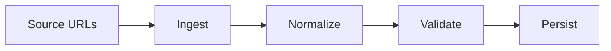

# data-pipeline-v3

ETL-focused project for ingestion, transformation, validation, and load patterns.

## Why This Exists

To demonstrate practical data engineering structure with testable stage boundaries.

## Architecture



## Project Layout

- `src/ingest/` source retrieval
- `src/transform/` normalize + schema checks
- `src/pipeline/` orchestration
- `src/load/` output sinks
- `tests/` unit tests
- `docs/` architecture + decisions

## Usage

```bash
python -m pytest -q
```

## Roadmap

- Add retry/backoff in ingest stage
- Add dedupe stage
- Add CSV and parquet sinks
