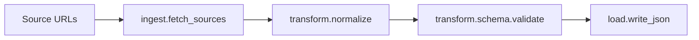

# Architecture

## Design Notes

- Stage isolation keeps failures localized and debuggable.
- Validation runs before sink writes to avoid partial bad output.
- Pipeline function returns records so callers can chain downstream work.
